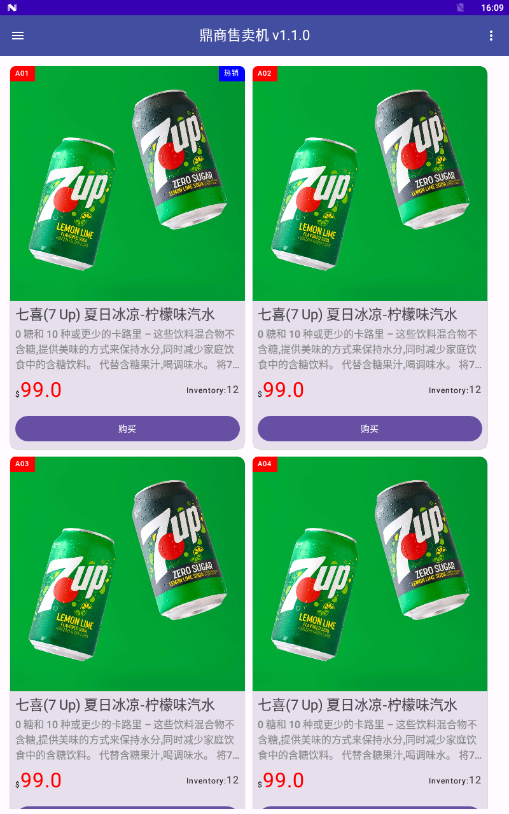

# Awish Vending Machine App Demo

## Manually fetch dependencies

```bash
./gradlew [ build | dependencies | --refresh-dependencies ]
```

## build

```bash
./gradlew assembleDebug
```

## sync

```bash
./gradlew sync
```

## screenshot


